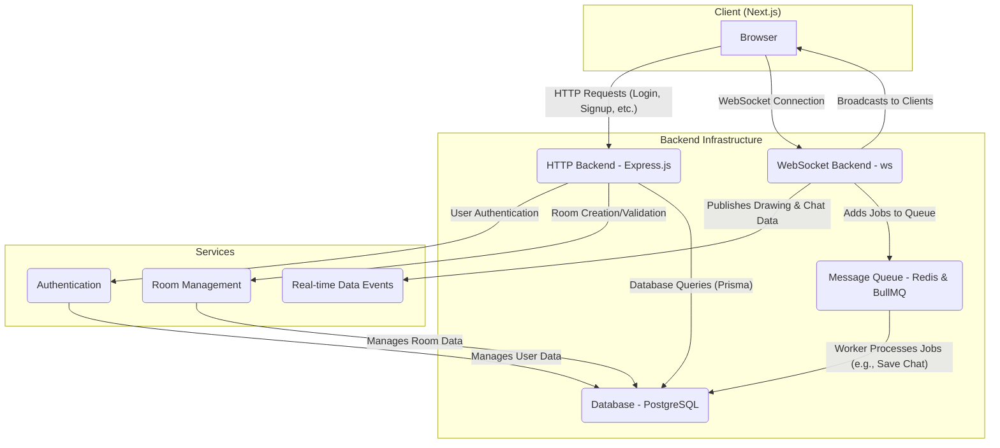

# Real-Time Drawing and Collaboration App

This is a full-stack, real-time drawing and collaboration application that allows multiple users to join rooms, draw on a shared canvas, and exchange data in real-time.

## System Design

The application uses a decoupled, scalable architecture. A Next.js client communicates with an HTTP backend for authentication and room management, while a dedicated WebSocket server handles all real-time data exchange. A message queue is used to process and persist data asynchronously.



## Features

-   **User Authentication**: Secure user registration and login with JWT-based session management.
-   **Room-Based Collaboration**: Users can create or join rooms to collaborate with others.
-   **Real-Time Drawing**: A shared canvas where multiple users can draw simultaneously.
-   **Real-Time Data Exchange**: The backend is equipped to handle real-time data, including chat messages, with persistence handled by a message queue.
-   **Scalable Architecture**: The decoupled backend ensures that the application can handle a growing number of users.

## Tech Stack

-   **Frontend**: [Next.js](https://nextjs.org/), [React](https://reactjs.org/), [Tailwind CSS](https://tailwindcss.com/)
-   **HTTP Backend**: [Express.js](https://expressjs.com/), [TypeScript](https://www.typescriptlang.org/)
-   **WebSocket Backend**: [ws](https://github.com/websockets/ws), [TypeScript](https://www.typescriptlang.org/)
-   **Database**: [PostgreSQL](https://www.postgresql.org/), [Prisma](https://www.prisma.io/)
-   **Message Queue**: [Redis](https://redis.io/), [BullMQ](https://bullmq.io/)
-   **Monorepo Management**: [pnpm](https://pnpm.io/), [Turborepo](https://turbo.build/)
-   **Validation**: [Zod](https://zod.dev/)

## Getting Started

To get the project up and running on your local machine, follow these steps.

### Prerequisites

-   [Node.js](https://nodejs.org/en/) (v18 or higher)
-   [pnpm](https://pnpm.io/installation)
-   [Docker](https://www.docker.com/get-started) (for running local PostgreSQL and Redis instances)

### Installation

1.  **Clone the repository**:
    ```bash
    git clone https://github.com/your-username/drawing-app.git
    cd drawing-app
    ```

2.  **Install dependencies**:
    ```bash
    pnpm install
    ```

3.  **Set up the database and Redis**:
    -   Start PostgreSQL and Redis instances using Docker:
        ```bash
        docker run --name drawing-app-db -e POSTGRES_PASSWORD=mysecretpassword -p 5432:5432 -d postgres
        docker run --name drawing-app-redis -p 6379:6379 -d redis
        ```
    -   Create a `.env` file in `packages/db` by copying the example:
        ```bash
        cp packages/db/.env.example packages/db/.env
        ```
    -   Update the `DATABASE_URL` in `packages/db/.env` with your database credentials.

4.  **Set up the backends**:
    -   Create `.env` files for the HTTP and WebSocket backends:
        ```bash
        cp apps/http-backend/.env.example apps/http-backend/.env
        cp apps/ws-backend/.env.example apps/ws-backend/.env
        ```
    -   Update the environment variables in the `.env` files. Ensure `REDIS_URL` in `apps/ws-backend/.env` is set (e.g., `redis://localhost:6379`).

### Running the Application

-   **Run database migrations**:
    ```bash
    pnpm db:migrate
    ```

-   **Start the development servers**:
    ```bash
    pnpm dev
    ```

This will start the client, HTTP backend, and WebSocket backend in development mode. The application will be accessible at `http://localhost:3000`.

## Project Structure

The project is a monorepo managed with pnpm and Turborepo.

-   `apps`:
    -   `client`: The Next.js frontend.
    -   `http-backend`: The Express.js backend for API requests.
    -   `ws-backend`: The WebSocket backend for real-time communication.
-   `packages`:
    -   `backend-common`: Shared utilities for the backends.
    -   `common`: Shared types and interfaces.
    -   `db`: The Prisma schema and database client.
    -   `eslint-config`: Shared ESLint configurations.
    -   `typescript-config`: Shared TypeScript configurations.
    -   `worker`: A worker service for processing jobs from the message queue (e.g., saving chat messages).

## API Endpoints

The HTTP backend provides the following endpoints:

-   `POST /auth/signup`: Register a new user.
-   `POST /auth/login`: Log in a user and create a session.
-   `POST /room/create`: Create a new collaboration room.
-   `GET /room/:roomId`: Get the details of a specific room.
-   `GET /room/join/:roomId`: Join a specific room.

All endpoints under `/room` require authentication.

## WebSocket Events

The WebSocket backend handles the following real-time events:

-   `join-room`: Sent when a user joins a room.
-   `leave-room`: Sent when a user leaves a room.
-   `send-data`: A generic event for sending data to other users in a room. The `message` payload contains the specific data type (e.g., `drawing`, `cursor`, or chat messages). Non-drawing data is queued for persistence.

## Environment Variables

Refer to the `.env.example` files in each application's directory for a complete list of variables.

-   **`apps/http-backend`**:
    -   `DATABASE_URL`: Connection string for the PostgreSQL database.
    -   `JWT_SECRET`: Secret key for signing JWTs.
    -   `PORT`: Server port.
-   **`apps/ws-backend`**:
    -   `PORT`: WebSocket server port.
    -   `REDIS_URL`: Connection URL for the Redis instance.
-   **`packages/db`**:
    -   `DATABASE_URL`: Connection string for the PostgreSQL database.

## Contributing

Contributions are welcome! If you have any ideas, suggestions, or bug reports, please open an issue or submit a pull request.
